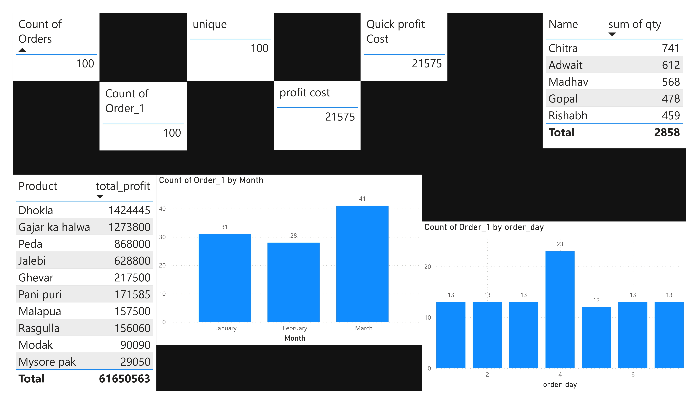

# PowerBI-DAX-Concepts-and-Implementation

This repository showcases my **hands-on learning and practical implementation of Power BI with a focus on DAX (Data Analysis Expressions)**. The project was built as a test-and-trial environment where I explored queries, measures, calculations, and time-based analysis to strengthen my Power BI fundamentals.

---

## Project Overview

The objective of this repository is to understand the **end-to-end Power BI workflow**—from data import and transformation to DAX calculations and dashboard-driven insights. All concepts were implemented practically while learning Power BI through a single comprehensive tutorial and self-experimentation.

---

## Topics Covered

* Introduction to Power BI
* Installation of Power BI Desktop
* Power BI interface and usage
* Importing data into Power BI
* Power Query Editor (data cleaning & transformation)
* DAX in Power BI
* Measures and calculations
* Charts and visualizations
* Filters and slicers
* Dashboard creation
* Business insights from dashboards

---

## DAX Queries Implemented

Below are the DAX functions and expressions practiced during this project:

```DAX
-- 1. Count of orders using COUNT
Count of Orders = COUNT('Order'[order_id])

-- 2. Count of rows in Order table
Count of Orders (Rows) = COUNTROWS('Order')

-- 3. Count of unique orders
Unique Order Count = DISTINCTCOUNT('Order'[order_id])

-- 4. Using comments in DAX
// This is a comment in the DAX query box

-- 6. Conditional statement using IF
Order Size Category = IF('Order'[order_qty] < 30, "Small Qty", "Large Qty")
```

---

## Measure vs Calculated Column (Key Concept)

**New Measure**

* Dynamic and calculated at query time
* Responds to filters and slicers
* Used mainly for aggregations and KPIs
* Does not show row-level values in table visuals

**New Column (Calculated Column)**

* Static and calculated during data refresh
* Stored in the data model
* Appears at row-level in table visuals
* Useful for categorization and row-based logic

---

## Time-Based Analysis

* Performed analysis on a **weekly and monthly basis**
* Identified trends and patterns over time
* Compared performance across different time periods

---

## Dashboard & Insights

* Created interactive dashboards using charts, slicers, and filters
* Enabled drill-down and comparison analysis
* Extracted meaningful insights from order and sales data

---

## Tools & Technologies Used

* Power BI Desktop
* DAX (Data Analysis Expressions)
* Power Query Editor

---

## Learning Outcome

Through this project, I gained practical experience in:

* Writing and testing DAX queries
* Understanding the difference between measures and calculated columns
* Building interactive dashboards
* Performing time-based business analysis

---

*This repository is created for learning, experimentation, and showcasing Power BI + DAX concepts and implementation.*



